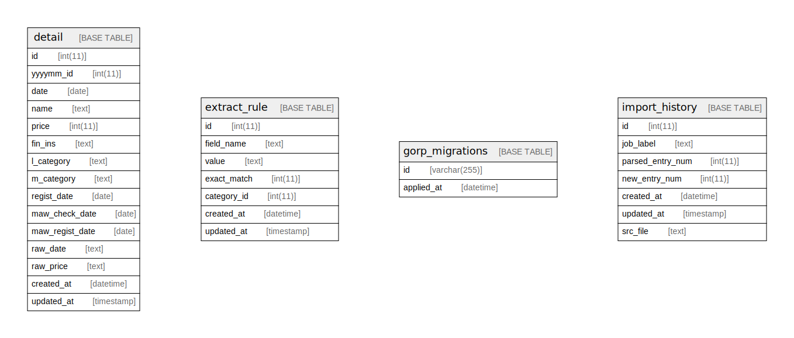

# mfimporter

## Tables

| Name | Columns | Comment | Type |
| ---- | ------- | ------- | ---- |
| [detail](detail.md) | 15 |  | BASE TABLE |
| [extract_rule](extract_rule.md) | 7 |  | BASE TABLE |
| [gorp_migrations](gorp_migrations.md) | 2 |  | BASE TABLE |
| [import_history](import_history.md) | 6 |  | BASE TABLE |

## Relations

---

> Generated by [tbls](https://github.com/k1LoW/tbls)
