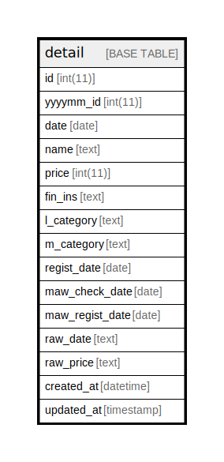

# detail

## Description

<details>
<summary><strong>Table Definition</strong></summary>

```sql
CREATE TABLE `detail` (
  `id` int(11) NOT NULL AUTO_INCREMENT COMMENT 'primary id',
  `yyyymm_id` int(11) NOT NULL COMMENT 'id for each yyyymm',
  `date` date NOT NULL COMMENT 'record date yyyymm',
  `name` text DEFAULT NULL COMMENT 'detail name',
  `price` int(11) DEFAULT NULL,
  `fin_ins` text DEFAULT NULL COMMENT 'finance instrcument name',
  `l_category` text DEFAULT NULL COMMENT 'large category name',
  `m_category` text DEFAULT NULL COMMENT 'medium category name',
  `regist_date` date NOT NULL COMMENT 'date running importer',
  `maw_check_date` date DEFAULT NULL COMMENT 'mawinter check date',
  `maw_regist_date` date DEFAULT NULL COMMENT 'mawinter regist check date',
  `raw_date` text DEFAULT NULL,
  `raw_price` text DEFAULT NULL,
  `created_at` datetime DEFAULT current_timestamp(),
  `updated_at` timestamp NOT NULL DEFAULT current_timestamp() ON UPDATE current_timestamp(),
  PRIMARY KEY (`id`),
  KEY `idx1` (`maw_check_date`),
  KEY `idx2` (`name`(768)),
  KEY `idx3` (`raw_price`(768))
) ENGINE=InnoDB AUTO_INCREMENT=[Redacted by tbls] DEFAULT CHARSET=utf8mb4 COLLATE=utf8mb4_unicode_ci
```

</details>

## Columns

| Name | Type | Default | Nullable | Extra Definition | Children | Parents | Comment |
| ---- | ---- | ------- | -------- | ---------------- | -------- | ------- | ------- |
| id | int(11) |  | false | auto_increment |  |  | primary id |
| yyyymm_id | int(11) |  | false |  |  |  | id for each yyyymm |
| date | date |  | false |  |  |  | record date yyyymm |
| name | text | NULL | true |  |  |  | detail name |
| price | int(11) | NULL | true |  |  |  |  |
| fin_ins | text | NULL | true |  |  |  | finance instrcument name |
| l_category | text | NULL | true |  |  |  | large category name |
| m_category | text | NULL | true |  |  |  | medium category name |
| regist_date | date |  | false |  |  |  | date running importer |
| maw_check_date | date | NULL | true |  |  |  | mawinter check date |
| maw_regist_date | date | NULL | true |  |  |  | mawinter regist check date |
| raw_date | text | NULL | true |  |  |  |  |
| raw_price | text | NULL | true |  |  |  |  |
| created_at | datetime | current_timestamp() | true |  |  |  |  |
| updated_at | timestamp | current_timestamp() | false | on update current_timestamp() |  |  |  |

## Constraints

| Name | Type | Definition |
| ---- | ---- | ---------- |
| PRIMARY | PRIMARY KEY | PRIMARY KEY (id) |

## Indexes

| Name | Definition |
| ---- | ---------- |
| idx1 | KEY idx1 (maw_check_date) USING BTREE |
| idx2 | KEY idx2 (name) USING BTREE |
| idx3 | KEY idx3 (raw_price) USING BTREE |
| PRIMARY | PRIMARY KEY (id) USING BTREE |

## Relations



---

> Generated by [tbls](https://github.com/k1LoW/tbls)
