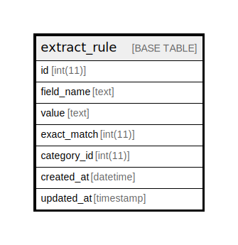

# extract_rule

## Description

<details>
<summary><strong>Table Definition</strong></summary>

```sql
CREATE TABLE `extract_rule` (
  `id` int(11) NOT NULL AUTO_INCREMENT COMMENT 'primary id',
  `field_name` text NOT NULL COMMENT 'extract field name (m_category or name)',
  `value` text NOT NULL,
  `exact_match` int(11) DEFAULT NULL COMMENT 'exact match = 1 or not 0',
  `category_id` int(11) NOT NULL COMMENT 'mawinter category id',
  `created_at` datetime DEFAULT current_timestamp(),
  `updated_at` timestamp NOT NULL DEFAULT current_timestamp() ON UPDATE current_timestamp(),
  PRIMARY KEY (`id`)
) ENGINE=InnoDB DEFAULT CHARSET=utf8mb4 COLLATE=utf8mb4_unicode_ci
```

</details>

## Columns

| Name | Type | Default | Nullable | Extra Definition | Children | Parents | Comment |
| ---- | ---- | ------- | -------- | ---------------- | -------- | ------- | ------- |
| id | int(11) |  | false | auto_increment |  |  | primary id |
| field_name | text |  | false |  |  |  | extract field name (m_category or name) |
| value | text |  | false |  |  |  |  |
| exact_match | int(11) | NULL | true |  |  |  | exact match = 1 or not 0 |
| category_id | int(11) |  | false |  |  |  | mawinter category id |
| created_at | datetime | current_timestamp() | true |  |  |  |  |
| updated_at | timestamp | current_timestamp() | false | on update current_timestamp() |  |  |  |

## Constraints

| Name | Type | Definition |
| ---- | ---- | ---------- |
| PRIMARY | PRIMARY KEY | PRIMARY KEY (id) |

## Indexes

| Name | Definition |
| ---- | ---------- |
| PRIMARY | PRIMARY KEY (id) USING BTREE |

## Relations



---

> Generated by [tbls](https://github.com/k1LoW/tbls)
