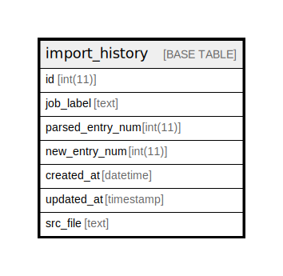

# import_history

## Description

<details>
<summary><strong>Table Definition</strong></summary>

```sql
CREATE TABLE `import_history` (
  `id` int(11) NOT NULL AUTO_INCREMENT COMMENT 'primary id',
  `job_label` text DEFAULT NULL COMMENT 'importer sets joblabel',
  `parsed_entry_num` int(11) NOT NULL,
  `new_entry_num` int(11) NOT NULL,
  `created_at` datetime DEFAULT current_timestamp(),
  `updated_at` timestamp NULL DEFAULT current_timestamp() ON UPDATE current_timestamp(),
  `src_file` text DEFAULT NULL,
  PRIMARY KEY (`id`),
  KEY `idx1` (`job_label`(768))
) ENGINE=InnoDB DEFAULT CHARSET=utf8mb4 COLLATE=utf8mb4_unicode_ci
```

</details>

## Columns

| Name | Type | Default | Nullable | Extra Definition | Children | Parents | Comment |
| ---- | ---- | ------- | -------- | ---------------- | -------- | ------- | ------- |
| id | int(11) |  | false | auto_increment |  |  | primary id |
| job_label | text | NULL | true |  |  |  | importer sets joblabel |
| parsed_entry_num | int(11) |  | false |  |  |  |  |
| new_entry_num | int(11) |  | false |  |  |  |  |
| created_at | datetime | current_timestamp() | true |  |  |  |  |
| updated_at | timestamp | current_timestamp() | true | on update current_timestamp() |  |  |  |
| src_file | text | NULL | true |  |  |  |  |

## Constraints

| Name | Type | Definition |
| ---- | ---- | ---------- |
| PRIMARY | PRIMARY KEY | PRIMARY KEY (id) |

## Indexes

| Name | Definition |
| ---- | ---------- |
| idx1 | KEY idx1 (job_label) USING BTREE |
| PRIMARY | PRIMARY KEY (id) USING BTREE |

## Relations



---

> Generated by [tbls](https://github.com/k1LoW/tbls)
